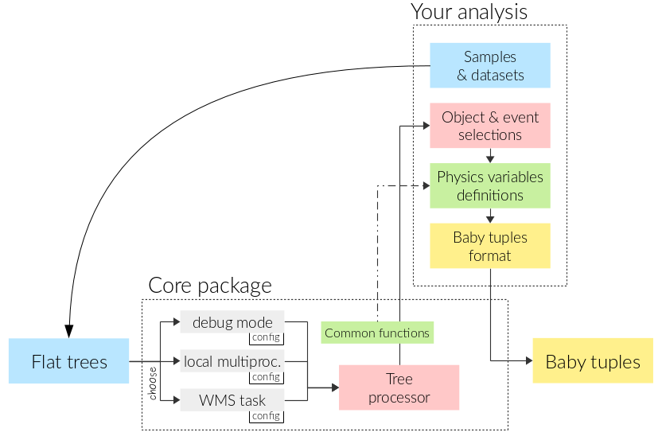

# Flattree Analysis

A framework to analyze flat ROOT trees to produce lighter 'babyTuples' trees.

Install and usage
-----------------

You will need `rootpy` installed somewhere. See instructions here :

```
http://www.rootpy.org/install.html
```

Then clone this repository :

```
git glone https://github.com/alexAubin/flatTreeAnalysis.git
```

Then plug your selections, babyTuple format, variables and datasets in `analysis/yourAnalysis`.



From `launch.py`, you can choose wether your want to run using debugging mode, local multiprocessing or WMS jobs.
