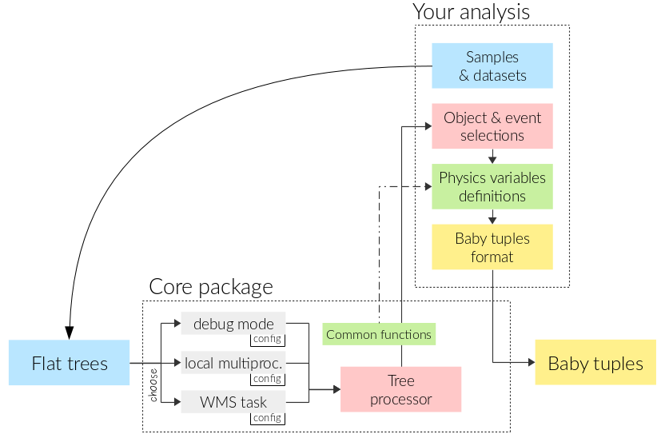

PyROOF
======

A PROOF-like package in Python that read ROOT trees, apply selections and compute variables, and save lighter 'babyTuples' trees.

Workflow
--------



Install
------

You will need `rootpy` installed somewhere. (Full instructions [here](http://www.rootpy.org/install.html))

```
git clone git://github.com/rootpy/rootpy.git
cd rootpy
python setup.py install --user
cd ..
```

Clone this repository :

```
git glone https://github.com/alexAubin/flatTreeAnalysis.git
```

Then plug your analysis selection, babyTuple format, variables and datasets in `analysis/yourAnalysis`, e.g. :

```
git clone https://github.com/oneLeptonStopAt13TeV/phys14Selection.git analysis/stopPhys14
```

Usage
-----

In the `/config/` folder, `config.py`, `localMultiprocessing.py` and `wmsTaskCreator.py` allow you to configure how you want things to be done, such as which analysis to use (in the previous example, stopPhys14). 

To get help about options (to launch in debug mode, local multiprocessing or WMS task), type

```
./PyROOF.py --help
```
